# Vaja6-7 - Varna infrastruktura za spletno aplikacijo in PB

Student: Velkov Michel
Datum: 14.4.2026

## 1) Brisanje starih AWS storitev
Pred novo postavitvijo sem pobrisal stare vire (v skladu z navodilom):
- VPC
- key pairs
- security groups
- route tables
- internet gateways
- S3
- EC2

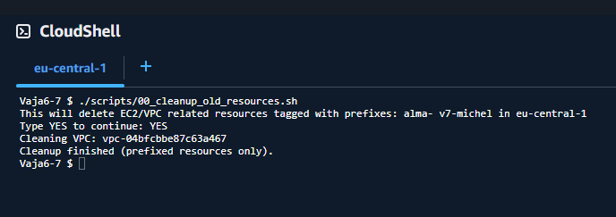
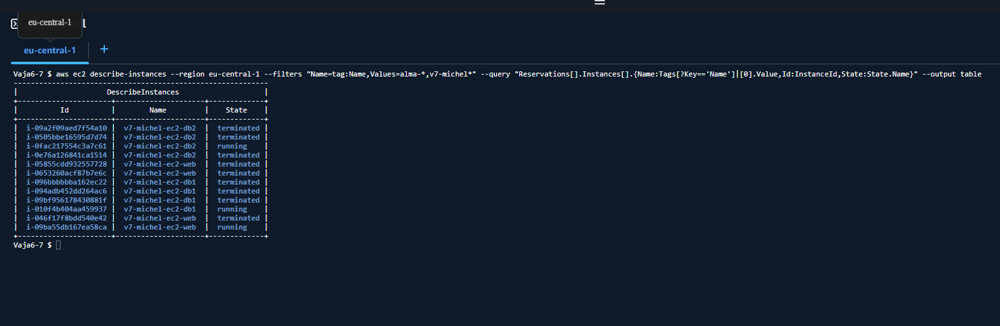

## 2) Nova infrastruktura
Ustvarjena je bila naslednja topologija:
- VPC: 192.168.0.0/24
- Sub1 public: 192.168.0.0/25 (AZ a)
- Sub2 private: 192.168.0.128/26 (AZ b)
- Sub3 private: 192.168.0.192/27 (AZ c)
- 1 key pair za vse 3 EC2
- 2 security group (web, db)
- 3 EC2 instance (web, db1, db2)
- internet gateway + route table
- NAT gateway + private route table

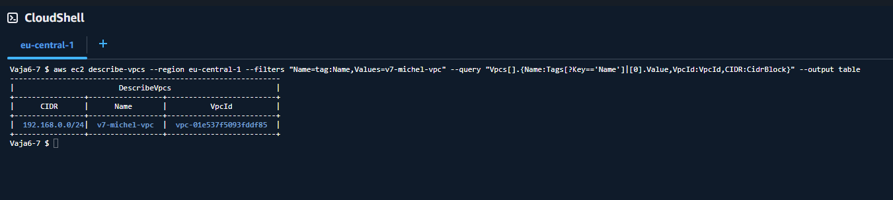
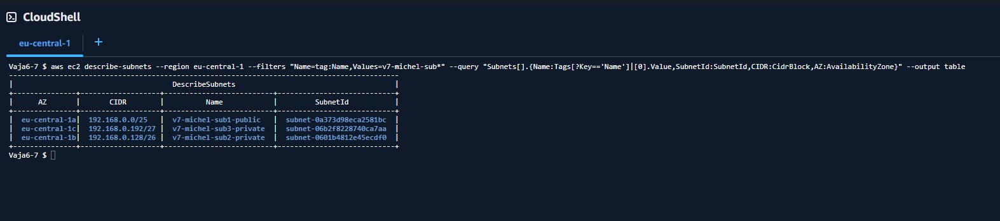
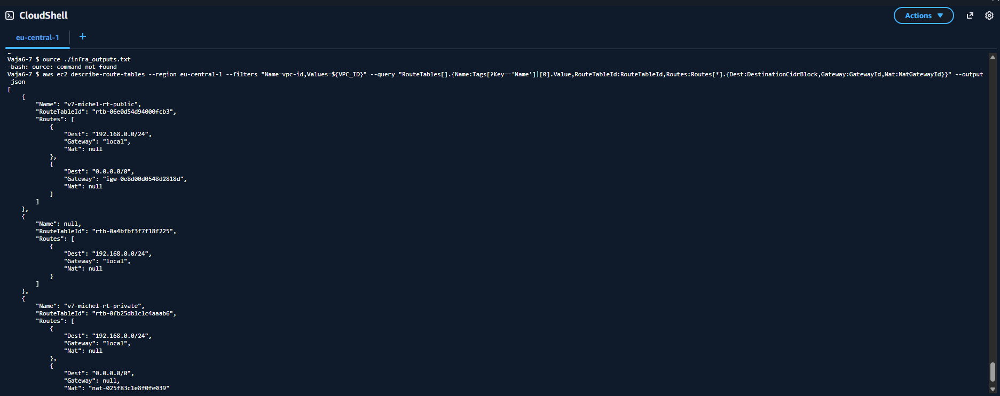
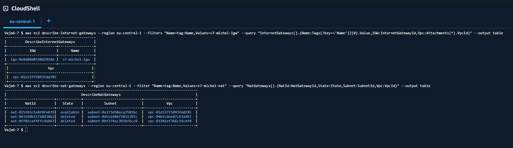
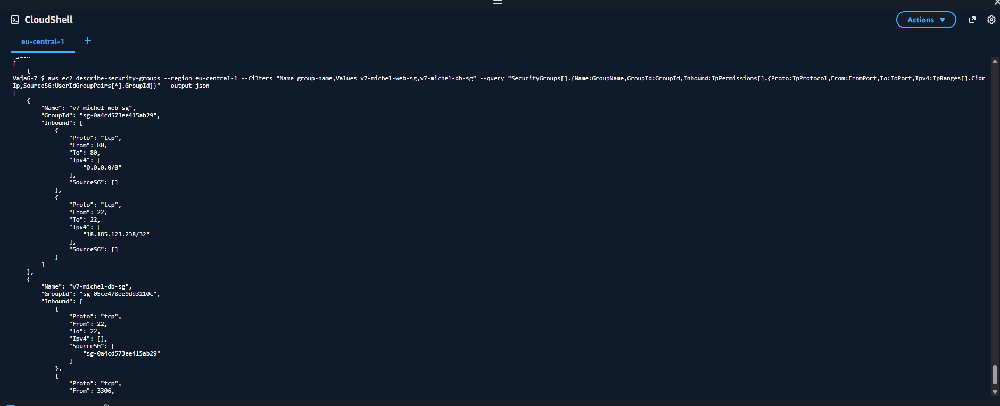
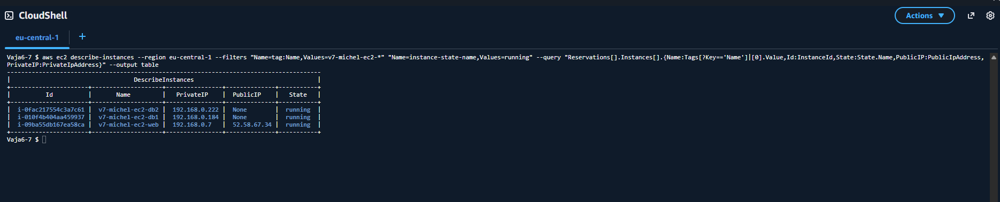

## 3) Web + PB delovanje
Aplikacija omogoca:
- vnos novega elementa nakupnega seznama (element, kolicina)
- izpis vseh elementov iz tabele nakup

Baza:
- DB: nakupni_seznam
- Tabela: nakup(id, element, kolicina)

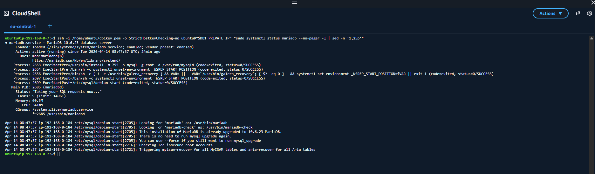
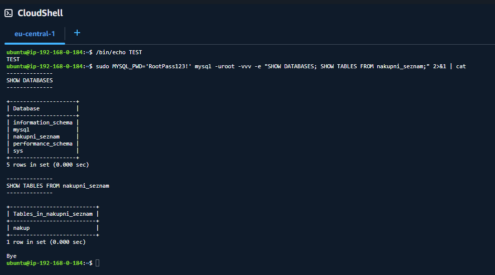
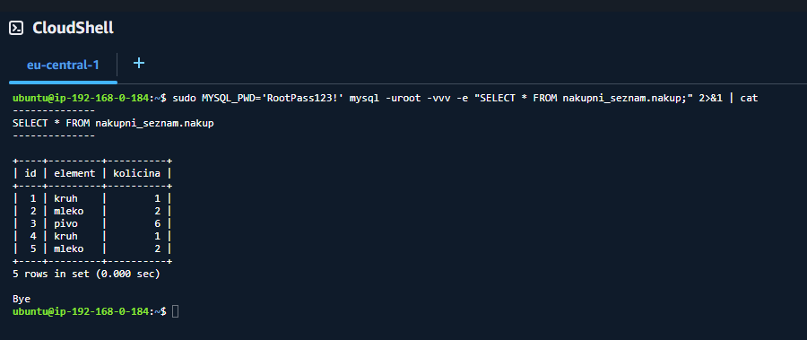
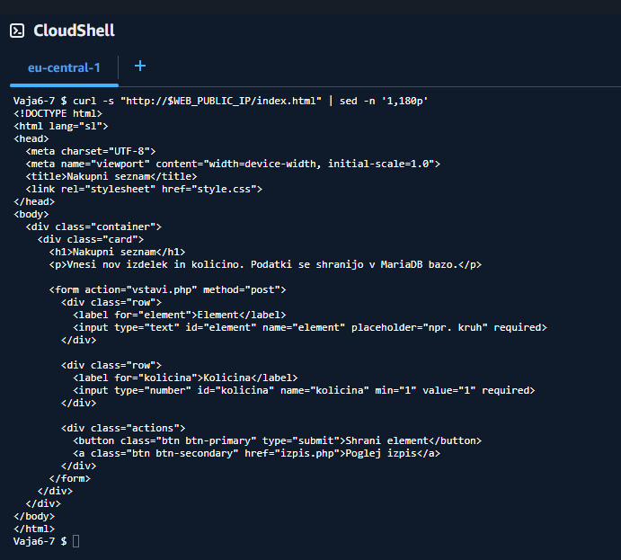
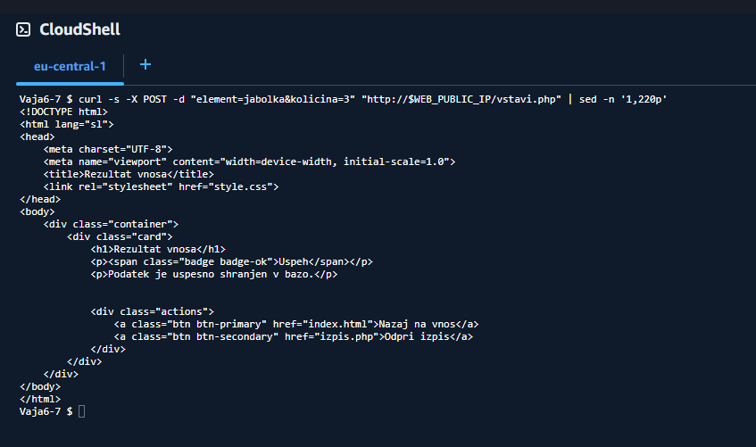
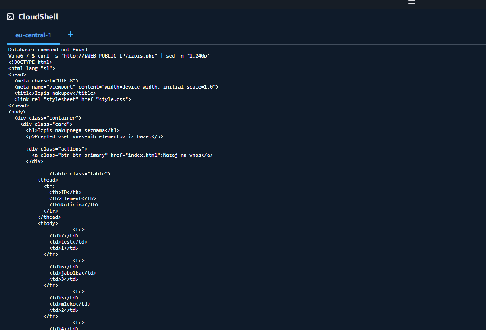

## 4) Ustavitev instanc po delu
Instance so po koncu dela ustavljene (niso izbrisane), kot zahtevano.

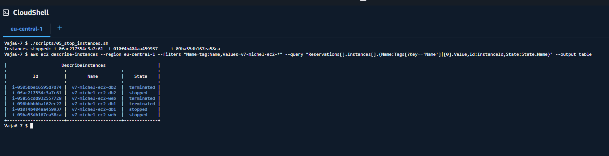

## 5) Odgovori na vprasanja

1. Kako se imenuje naslov racunalnika, s katerim ga identificiramo v omrezju?
- To je IP naslov.

2. Kaj je data center?
- Data center je fizicna lokacija z infrastrukturo (strezniki, omrezje, napajanje, hlajenje), kjer tecejo IT storitve.

3. Kaj pomeni CIDR zapis 192.168.0.16/28?
- Pomeni subnet z masko /28, to je 16 naslovov skupaj (14 uporabnih host naslovov).

4. Kako naredimo podomrezje privatno?
- V route table nima poti 0.0.0.0/0 do internet gatewaya in instance nimajo javnega IP.

5. Kako naredimo podomrezje javno?
- Podomrezje je povezano na route table s potjo 0.0.0.0/0 do IGW in instance lahko dobijo javni IP.

6. Kaj dosezemo, ce imamo vire v razlicnih AZ?
- Vecjo razpolozljivost in odpornost na izpad posamezne AZ.

7. Kaj je scp? Cemu sluzi? Kaj lahko uporabimo namesto scp?
- scp je varen prenos datotek prek SSH. Namesto tega lahko uporabimo SFTP, rsync ali WinSCP/MobaXterm.

8. Cemu je namenjena routing table?
- Doloca, kam se usmerja promet iz subneta (npr. lokalno, IGW, NAT).

9. Kaj moramo nastaviti, da so racunalniki v podomrezjih vidni med seboj?
- Morajo biti v istem VPC, imeti ustrezne route in security group pravila, ki promet dovolijo.

10. Zakaj uporabljamo locena podomrezja za web in db?
- Zaradi varnosti in segmentacije. Javni del je locen od notranje podatkovne plasti.

11. Zakaj mora biti web v javnem subnetu, DB pa v privatnem?
- Web mora biti dosegljiv uporabnikom z interneta, DB pa naj bo dosegljiva samo znotraj VPC.

12. Zakaj ne dovolimo neposrednega dostopa iz interneta do baze?
- To zmanjsa napadno povrsino in tveganje kraje/brisanja podatkov.

13. Zakaj uporabljamo security groups, ce imamo ze subnet?
- SG so dodatna plast filtriranja na nivoju instance/portov/protokolov.

14. Zakaj morata biti subnet2 in subnet3 v razlicnih AZ?
- Za visjo razpolozljivost in odpornost na izpad ene AZ.

15. Zakaj uporabljamo SSH kljuc in ne gesla?
- SSH kljuc je varnejsi, bolj robusten proti brute-force napadom in lazje avtomatizira dostop.

16. Kaj bi se zgodilo, ce bi bila MariaDB v javnem subnetu z odprtim 3306?
- Baza bi bila javno izpostavljena, tveganje nepooblascenega dostopa in napadov bi bilo bistveno vecje.

17. Zakaj naj web dostopa do DB prek privatnega omrezja in ne javnega IP?
- Privatna povezava je varnejsa, hitrejsa in ni javno izpostavljena.

18. Kaj bi se zgodilo, ce izbrisemo internet gateway iz VPC?
- Javne instance ne bi bile dosegljive z interneta, spletna stran in SSH od zunaj bi prenehala delovati; NAT promet za private subnet bi tudi prenehal.

## 6) Seznam oddanih datotek
- scripts/00_cleanup_old_resources.sh
- scripts/01_setup_infra.sh
- scripts/02_configure_db1.sh
- scripts/03_deploy_app.sh
- scripts/04_verify_db2.sh
- scripts/05_stop_instances.sh
- scripts/helper_db1_commands.sh
- app/index.html
- app/config.php
- app/vstavi.php
- app/izpis.php
- db/init.sql
- slike/*

## 7) Seznam zahtevanih screenshotov
- slike/cleanup/01-cleanup-script-run.png
- slike/cleanup/02-no-old-resources.png
- slike/infra/01-vpc.png
- slike/infra/02-subnets.png
- slike/infra/03-route-tables.png
- slike/infra/04-igw-nat.png
- slike/infra/05-security-groups.png
- slike/infra/06-ec2-instances.png
- slike/app-db/01-db-install-db1.png
- slike/app-db/02-db-created-table.png
- slike/app-db/03-test-data-insert.png
- slike/app-db/04-web-index-form.png
- slike/app-db/04-web-index-form2.png
- slike/app-db/05-web-insert-success.png
- slike/app-db/05-web-insert-success2.png
- slike/app-db/06-web-izpis.png
- slike/app-db/06-web-izpis2.png
- slike/shutdown/01-instances-stopped.png
