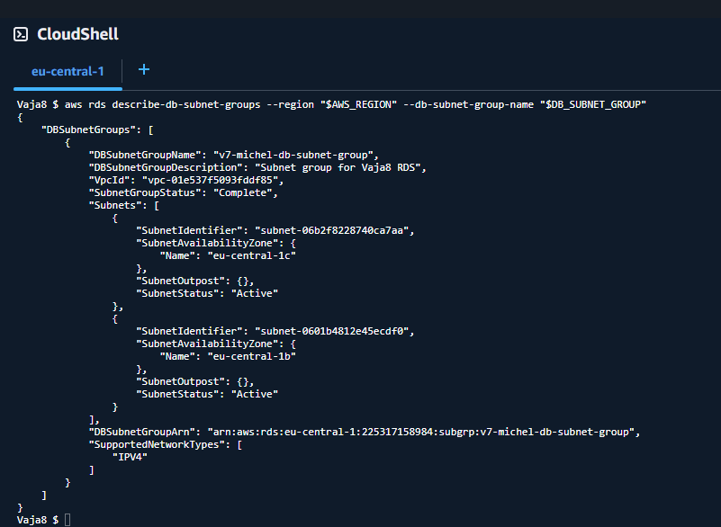
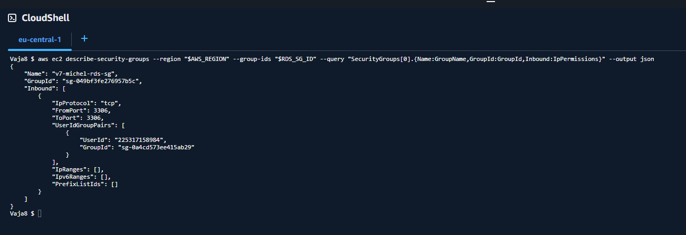
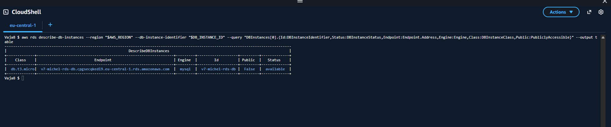
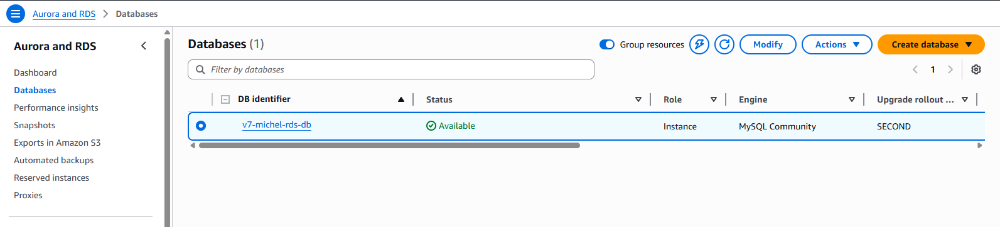
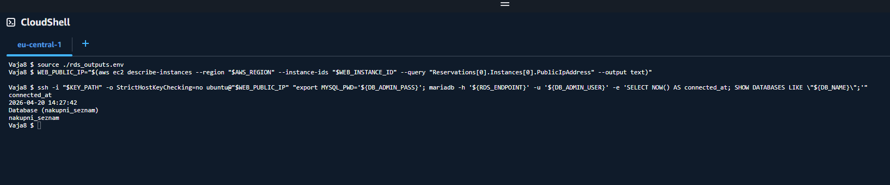
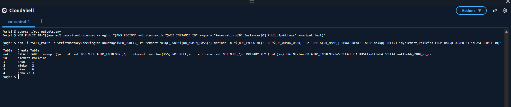
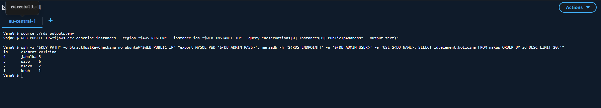
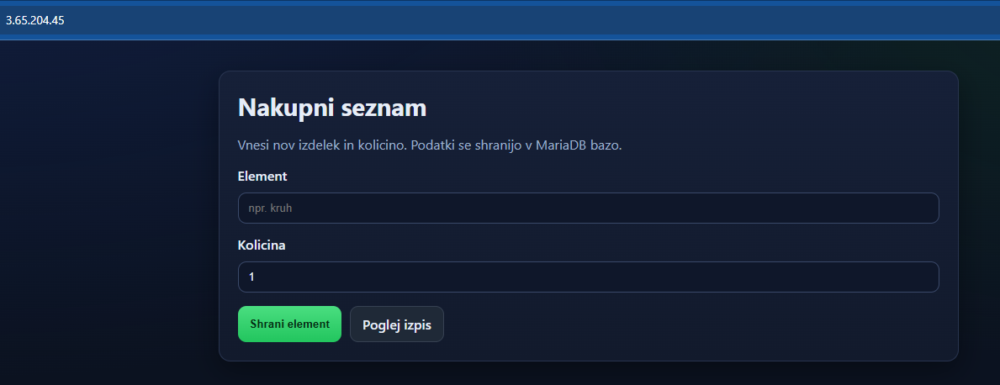
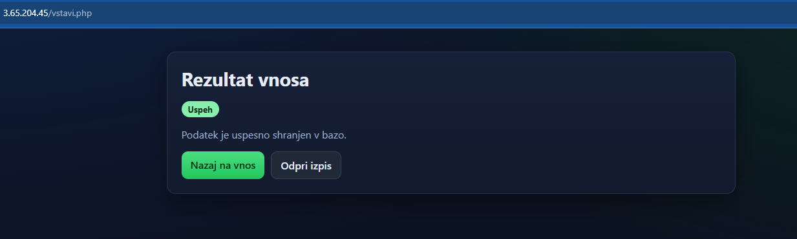
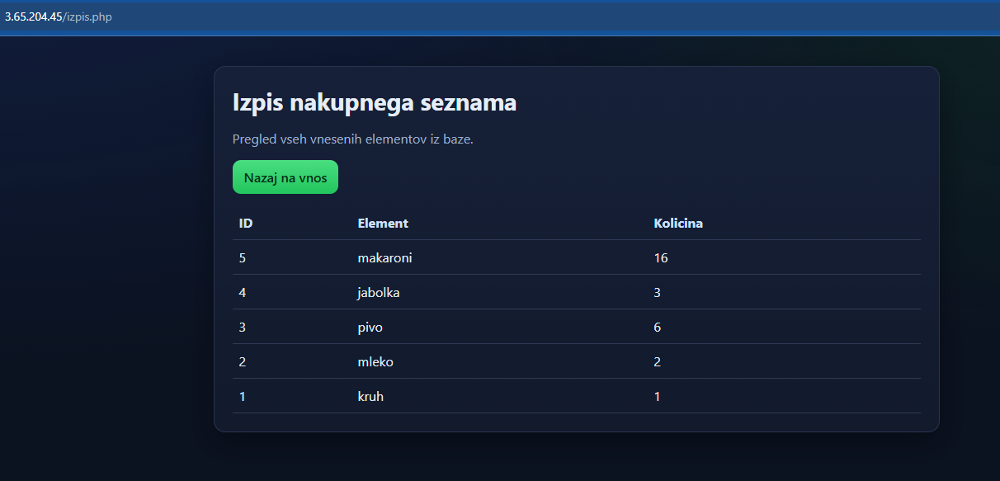

# Vaja8 - Prehod iz EC2 MariaDB na RDS

Student: Velkov Michel
Datum: 20.4.2026

## 1) Cilj naloge
Cilj je zamenjati PB na EC2 (self-managed MariaDB) z AWS RDS (managed MySQL/MariaDB) in aplikacijo povezati na novo bazo.

## 2) Arhitektura pred in po spremembi
Pred:
- web aplikacija na EC2 (javni subnet)
- MariaDB na EC2 (privatni subnet)

Po:
- web aplikacija ostane na EC2 (javni subnet)
- PB tece na RDS instanci v privatnem subnetu
- dostop do RDS je dovoljen samo iz security group od web EC2

## 3) Priprava RDS odvisnosti
Ustvarjeno:
- 2 subneta v razlicnih AZ (v istem VPC)
- DB subnet group
- RDS security group
- inbound pravilo na RDS SG: mysql/3306 iz source SG od web EC2

Dokazi:

## 4) Ustvarjanje RDS instance
Nastavitve:
- Engine: MySQL ali MariaDB (free tier)
- Public access: No
- Credentials: self managed
- VPC + subnet group + RDS SG iz prejsnjega koraka

Dokazi:

## 5) Povezava EC2 aplikacije na RDS
Na web EC2:
- namescen mariadb-client
- testna povezava na RDS endpoint
- kreirana baza in tabela (ali migrirani podatki)
- aplikacija posodobljena na RDS host

Dokazi:

## 6) Test aplikacije
Potrjeno:
- index deluje
- vnos shrani v RDS
- izpis vrne podatke iz RDS

Dokazi:

## 7) Primerjava EC2 PB vs RDS
- RDS plus: manj operativnega dela (backup, patching, monitoring)
- RDS minus: visja cena in manj nizkonivojske fleksibilnosti
- EC2 plus: popoln nadzor in nizja cena
- EC2 minus: vse operacije in varnostne naloge so na nas

## 8) Varnost in odgovornosti
- Shared responsibility: AWS varuje infrastrukturo, mi varujemo konfiguracijo, credentials, SG, aplikacijske skrivnosti.
- RDS ni privzeto varen za vse primere; pravila SG in least privilege account so obvezni.

## 9) Odgovori na vprasanja
1. Zakaj RDS potrebuje subnet group z vsaj dvema AZ?
- Zaradi arhitekturnih zahtev storitve in moznosti visje razpolozljivosti.

2. Zakaj je source pri RDS SG bolje nastaviti na EC2 SG in ne na IP?
- Ker je to bolj varno in robustno; pravilo je vezano na identiteto instance (SG), ne na spreminjajoci IP.

3. Kaj je glavna razlika med self-managed DB na EC2 in managed DB na RDS?
- Pri EC2 skoraj vse upravljamo sami; pri RDS veliko operativnih nalog upravlja AWS.

4. Zakaj Public access za RDS nastavimo na No?
- Da PB ni neposredno izpostavljena internetu in je dosegljiva samo znotraj VPC pravil.

5. Kaj se zgodi, ce je RDS SG prevec odprt (0.0.0.0/0 na 3306)?
- Mocno se poveca napadna povrsina in tveganje nepooblascenega dostopa.

## 10) Seznam oddanih datotek
- POROCILO_VAJA8.md
- scripts/01_setup_rds.sh
- scripts/02_migrate_app_to_rds.sh
- scripts/99_cleanup_rds.sh
- slike/rds/*
- slike/povezava/*
- slike/app/*

## 11) Seznam zahtevanih screenshotov
- slike/rds/01-db-subnet-group.png
- slike/rds/02-rds-sg-rules.png
- slike/rds/03-rds-create-settings.png
- slike/rds/04-rds-endpoint-available.png
- slike/povezava/01-ec2-rds-connect-test.png
- slike/povezava/02-create-db-table.png
- slike/povezava/03-seed-data.png
- slike/app/01-web-index.png
- slike/app/02-web-insert-success.png
- slike/app/03-web-izpis.png
